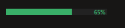

# ClaudePulse

A lightweight Windows utility that shows your Claude.ai usage at a glance — always on top, always out of the way.

## Screenshots

**Compact bar** — sits in the corner of your screen, color-coded by usage:


**Details window** — right-click → Show Details for a full usage panel:



## What it does

- **Compact mode** — a thin colored bar sits in the corner of your screen showing your current usage %
- **Expanded mode** — click the bar to see a quick breakdown: session, weekly limits, extra credits
- **Details window** — right-click → **Show Details** for a full Claude-style usage panel with progress bars
- **Color coding** — green → yellow → red as usage climbs past configurable thresholds
- **Auto-fetches data** — reads your session key from browser cookies automatically; no manual setup
- **Always on top** — draggable to any screen position; position is remembered across restarts

## Quick start

**Option A — Download the exe (no Python needed)**

1. Download `ClaudePulse.exe` from [Releases](../../releases)
2. Double-click to run — a thin bar appears in the bottom-right corner
3. Install the browser extension (see below) so data updates automatically

**Option B — Run from source**

```bash
pip install -r requirements.txt
python main.py
```

## Browser extension setup

The extension auto-sends your Claude.ai session key to the app whenever it changes.

1. Open your browser's extension page:
   - Comet: `comet://extensions`
   - Chrome: `chrome://extensions`
   - Edge: `edge://extensions`
2. Enable **Developer mode** (toggle, top-right)
3. Click **Load unpacked** → select the `extension/` folder

Done. The app picks up your session key within seconds.

> **Without the extension:** the app tries to read cookies directly from installed browsers, or you can paste the key manually via right-click → Settings.

## Usage

| Action | Result |
|---|---|
| Click the bar | Toggle expanded / compact view |
| Drag | Move anywhere on screen |
| Right-click → Show Details | Full usage panel matching Claude's UI |
| Right-click → Settings | Configure thresholds, session key, refresh rate |
| Right-click → Quit | Exit the app |
| System tray icon | Shows current % in tooltip; right-click to access menu |

## Details window

Right-click the bar and select **Show Details** to open a dedicated panel that mirrors Claude's own usage page:

- **Plan usage limits** — current session bar with reset timer
- **Weekly limits** — all-models and per-model bars (Claude Sonnet, Claude Design, etc.)
- **Additional features** — extra credits, daily routine runs with counts
- **Last updated** — timestamp of the last successful data fetch

## Configuration

Right-click → **Settings** to adjust:

- **Session key** — auto-detected from browser; override here if needed
- **Warning threshold** — default 70% (bar turns yellow)
- **Critical threshold** — default 85% (bar turns red)
- **Refresh interval** — default 60 seconds

Settings are saved to `config.json` next to the exe.

## Building from source

Requires Python 3.11+ and PyInstaller.

```bash
pip install -r requirements.txt
pip install pyinstaller
pyinstaller ClaudePulse.spec
# Output: dist/ClaudePulse.exe
```

## How it works

1. Reads your `sessionKey` cookie from the browser (Comet, Chrome, Edge, Brave)
2. Calls `claude.ai/api/account` to get your org UUID
3. Calls `claude.ai/api/organizations/{uuid}/usage` every 60 seconds
4. Uses `curl_cffi` with Chrome TLS fingerprint impersonation to bypass Cloudflare
5. The browser extension pushes updated keys automatically via a local HTTP server on port 54321

## Requirements

- Windows 10/11
- Comet, Chrome, Edge, or Brave browser with an active Claude.ai session
- Claude Pro account

## License

MIT
